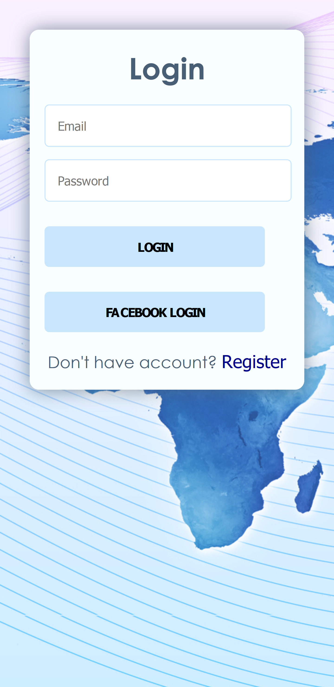
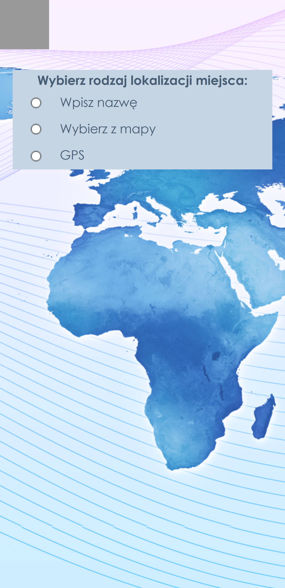
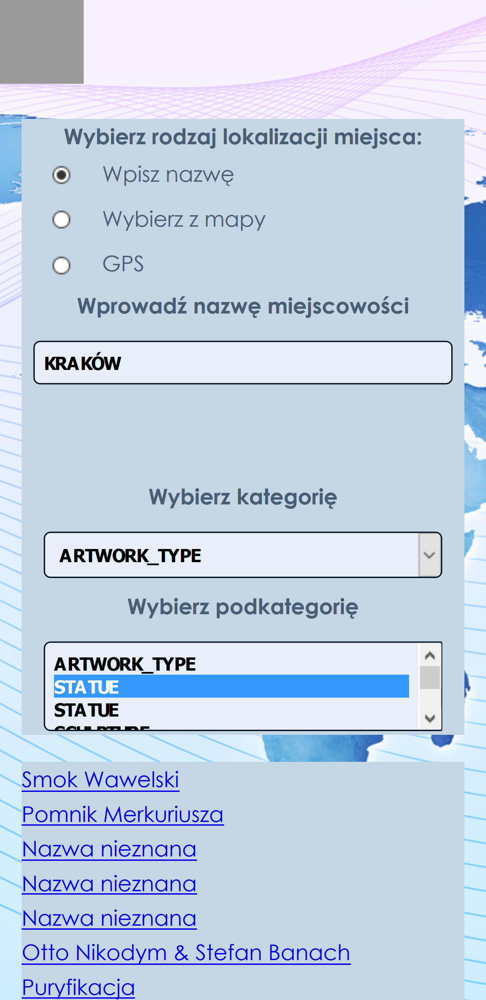
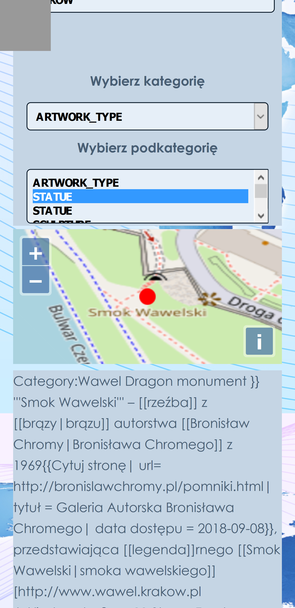

## Charakterystyka projektu aplikacji mobilnej
  
Aplikacja mobilna o nazwie „Zobacz” ma wyświetlać informację na temat ciekawych lokacji w danej
miejscowości. Aplikacja mawyświetlać informację na temat zabytków oraz różnych atrakcji turystycznych 
w danym rejonie. Logowanie i rejestracja będzie odbywała się metodą tradycyjną. Możliwe również będzie 
logowanie się za pomocą Facebook’a. Będzie również posiadała dodatkową funkcjonalność, czyli pobranie 
danych lokalizacyjnych przekazanych przez GPS, a więc co za tym idzie pokazanie miejsca w którym się 
znajdujemy zamiast wprowadzania jakichkolwiek danych jak na przykład miejścowość.

Interfejs umożliwia wybór miejscowości na kilka sposobów

1. podanie nazwy miejscowości
2. pozycjonowanie przy użyciu GPS
3. wybranie miejsca na mapie

Aplikacja będzie wykorzystywać, w celu wyboru miejscowości, API dostępne na stronie:
[https://overpass-api.de/](https://overpass-api.de/)
W celu poprawy wyglądu zostanie użyty w kilku elementach Framework jQuery Mobile.

  
## Projekt dostępny tutaj

[Repozytorium aplikacji mobilnej](https://github.com/zobaczteam/zobaczMobile) 
  
  
## Skład zespołu projektowego

1. **Piotr Szczepański, 203911, KrZZIs3011Io (kierownik zespołu)**
2. **Anna Wąsowicz,     161353, KrZZIs3011Io**
3. **Jakub Piasecki,    203073, KrZZIs3011Io**
4. **Patryk Materzok,   178301, KrZZIs3011Io**
  
## Cel oraz cechy aplikacji

Celem aplikacji jest pokazanie na mapie ciekawych oraz wartych zobaczenia miejsc na mapie i wyświetlanie
informacji odnośnie danego miejsca lub obiektu.

Poniżej prezentujemy stronę logowania. Można również zalogować się przy użyciu Facebooka

Gdy już jesteśmy zalogowani lub zarejestrowaliśmy się na "zobacz" aplikacji.
Wybieramy metodę wskazania miejsca.

Można wybrać trzy metody lokalizacji. Poprzez wpisanie nazwy, wskazanie na mapie lub przy użyciu danych z GPS.
W każdym z przypadków będziemy mieli do wyboru kategorię tego czego szukamy, oraz dostępne miejsca.

  
## Linki do składowych projektu

#### Prototyp
[Marvel prototyp aplikacji mobilnej](https://marvelapp.com/c064774)
  
#### Zarządzanie projektem
[Tablica Kanban Trello](https://trello.com/b/M3WWCiDO)

#### Diagram aplikacji
[Diagram DIA](https://github.com/Stiepek/zobacz/blob/master/DiagramDIA.png)
